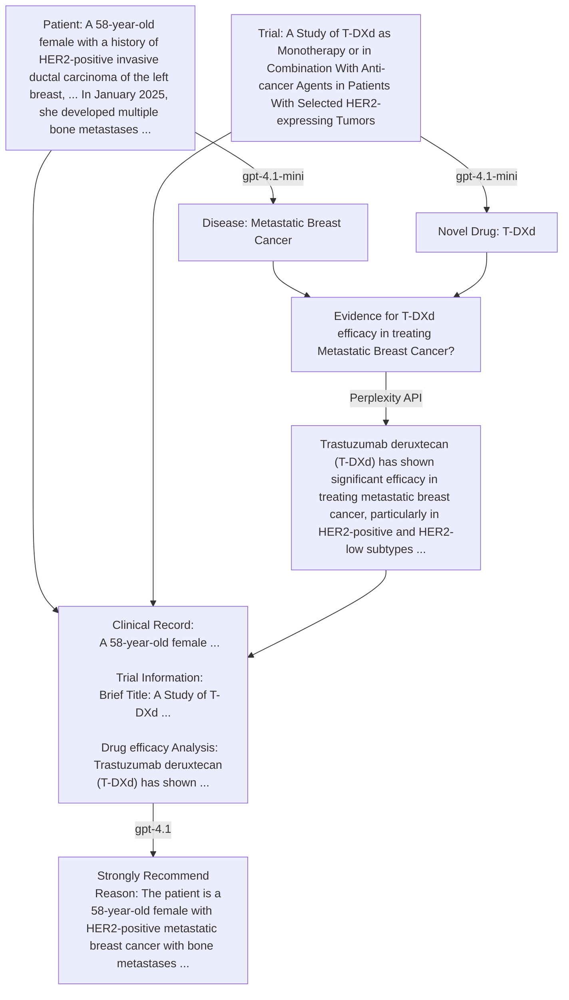

# ClinTrialFinder

ClinTrialFinder is a sophisticated tool for downloading, filtering, analyzing, and ranking clinical trials data from ClinicalTrials.gov. It combines web crawling capabilities with intelligent filtering using GPT-4.1-mini, evidence-based analysis using Perplexity AI, and AI-powered ranking to help researchers and medical professionals find the most relevant and promising clinical trials. The tool accepts natural language descriptions of conditions (e.g. "early stage breast cancer in women over 50") and uses GPT-4.1-mini to evaluate these conditions against both the trials' titles and inclusion criteria to find relevant matches. It then analyzes the trial in the context of current medical evidence to provide a recommendation level, and finally ranks the trials from best to worst match for the patient using pairwise comparisons.

## Features

- **Automated Data Collection**: Crawls ClinicalTrials.gov using their API v2 to fetch trial data based on disease name
- **Smart Filtering**: Uses GPT-4.1-mini to evaluate trial eligibility based on:
  - Trial titles
  - Inclusion criteria
- **Evidence-Based Analysis**: Uses Perplexity AI to gather current medical evidence related to the trial's novel drug and the patient's condition.
- **Intelligent Recommendations**: Uses GPT-4.1 to provide a recommendation level for each trial based on the patient's condition, trial details, and current medical evidence.
- **AI-Powered Ranking**: Uses GPT-4.1 with quicksort algorithm to rank trials from best to worst match for the patient through pairwise comparisons.
- **Clinical Record Analysis**: Extracts relevant conditions, demographics, and clinical status from patient records using GPT-4.1.
- **Flexible Search Options**: Filter trials by:
  - Recruitment status
  - Trial phase
  - Study type
  - Custom conditions and criteria
- **Email Service**: Send clinical summaries via email for instant trial matching without any setup

## Analyzing Clinical Trials

Below is a flowchart demonstrating the process of analyzing a clinical trial against a patient clinical record:



## Cost Calculation and Tracking

ClinTrialFinder includes comprehensive cost tracking for all GPT API operations. This helps you monitor and budget your API usage costs.

### How It Works

- **Automatic Cost Calculation**: Every GPT API call automatically calculates costs based on input/output token usage
- **Real-time Tracking**: Costs are tracked per operation and accumulated across sessions
- **Detailed Reporting**: Get cost breakdowns by case, operation type, and model used
- **Export Capabilities**: Cost data is included in CSV exports for further analysis

### Supported Models and Pricing

The system supports all major GPT models with current pricing:

| Model | Input Cost (per 1K tokens) | Output Cost (per 1K tokens) |
|-------|---------------------------|----------------------------|
| GPT-5 | $0.00125 | $0.01000 |
| GPT-4o | $0.00250 | $0.01000 |
| GPT-4o-mini | $0.00015 | $0.00060 |
| GPT-4.1 | $0.00200 | $0.00800 |
| GPT-4.1-mini | $0.00040 | $0.00160 |

### Cost Tracking Features

- **Per-case Cost Tracking**: Individual costs for each clinical trial analysis
- **Session Totals**: Accumulated costs across multiple operations
- **Cost Statistics**: Average, minimum, and maximum costs per operation
- **Model-specific Tracking**: Separate cost tracking for different GPT models
- **Cache-aware Costing**: Only charges for actual API calls, not cached responses

### Example Cost Output

```
GPT API COST STATISTICS
--------------------------------------------------------------------------------
Total cost: $0.023400
Number of cases processed: 15
Average cost per case: $0.001560
Minimum cost per case: $0.000800
Maximum cost per case: $0.003200
--------------------------------------------------------------------------------
```

### Testing Cost Calculation

You can test the cost calculation functionality using the provided test script:

```bash
python -m scripts.test_cost_calculation
```

This script will:
- Test cost calculations with different prompt lengths
- Verify cost accuracy across different models
- Show detailed cost breakdowns
- Demonstrate the pricing utility functions

## Installation

1. Clone the repository:

   ```bash
   git clone https://github.com/yourusername/ClinTrialFinder.git
   cd ClinTrialFinder
   ```

2. Install dependencies:

   ```bash
   pip install -r requirements.txt
   ```

3. Set up your OpenAI and Perplexity API keys:

   ```bash
   export OPENAI_API_KEY='your-openai-api-key-here'
   export PERPLEXITY_API_KEY='your-perplexity-api-key-here'
   ```

## Usage

### Crawling Clinical Trials

To download clinical trials data:

```bash
python -m scripts.download_trials --condition "breast cancer" --exclude-completed
```

Options:

- `--condition`: Disease or condition to search for (required if not using --specific-trial)
- `--exclude-completed`: Only include trials that are 'Not Yet Recruiting' or 'Recruiting' (optional)
- `--output-file`: Output file path (default: {condition}_trials.json)
- `--specific-trial`: Download a specific trial by NCT ID (required if not using --condition)
- `--log-level`: Set the Scrapy log level (DEBUG, INFO, WARNING, ERROR, CRITICAL)
- `--include-broader`: Also download trials for broader disease categories
- `--openai-api-key`: OpenAI API key for broader category identification (alternatively, use OPENAI_API_KEY environment variable)

Examples:

```bash
# Download all trials for breast cancer
python -m scripts.download_trials --condition "breast cancer"

# Download only 'Not Yet Recruiting' or 'Recruiting' trials for breast cancer
python -m scripts.download_trials --condition "breast cancer" --exclude-completed

# Download a specific trial by NCT ID
python -m scripts.download_trials --specific-trial "NCT04815720"

# Specify a custom output file
python -m scripts.download_trials --condition "breast cancer" --output-file "my_breast_cancer_trials.json"

# Get more detailed logs
python -m scripts.download_trials --condition "breast cancer" --log-level DEBUG

# Download trials for both glioblastoma and broader categories like "brain tumor"
python -m scripts.download_trials --condition "glioblastoma" --include-broader --openai-api-key $OPENAI_API_KEY
```

When using the `--include-broader` option, the script will:

1. Identify broader disease categories using GPT (e.g., for "glioblastoma", it might identify "brain tumor" and "central nervous system cancer")
2. Download trials for the original condition
3. Download trials for each broader category
4. Merge all trials into a single output file, removing duplicates

This is useful for finding more potentially relevant trials that might be categorized under broader disease terms.

### Filtering Trials

To filter trials based on specific conditions:

```bash
python -m scripts.filter_trials trials.json "breast cancer with bone metastases" "HER2 positive" "ECOG score is 1" \
    --recruiting \
    --phase 2 \
    --exclude-study-type Observational \
    --output filtered_trials.json
```

Options:

- `--recruiting`: Filter for only recruiting trials
- `--phase`: Filter by trial phase (1-4)
- `--exclude-study-type`: Exclude specific study types
- `--recommendation-level`: Filter by recommendation level(s) ("Strongly Recommended", "Recommended", "Neutral", "Not Recommended"). Can specify multiple levels at once.
- `--output`: Specify output file path
- `--cache-size`: Set maximum number of cached responses (default: 10000)
- `--api-key`: Provide OpenAI API key (alternatively, use OPENAI_API_KEY environment variable)

The filtering process can be pipelined by using the output file from one filtering operation as the input for the next. For example:

```bash
# First filter for breast cancer trials with bone metastases
python -m scripts.filter_trials trials.json "breast cancer with bone metastases" --output bone_metastases_breast_cancer_trials.json

# Then filter those results for HER2 positive
python -m scripts.filter_trials bone_metastases_breast_cancer_trials.json "HER2 positive" --output her2_positive_trials.json

# Finally filter those results for ECOG score is 1
python -m scripts.filter_trials her2_positive_trials.json "ECOG score is 1" --output ecog_1_trials.json

# Filter for only strongly recommended trials
python -m scripts.filter_trials analyzed_filtered_trials.json --recommendation-level "Strongly Recommended" -o strongly_recommended_trials.json

# Filter for both recommended and strongly recommended trials in a single command
python -m scripts.filter_trials analyzed_filtered_trials.json --recommendation-level "Strongly Recommended" "Recommended" -o recommended_trials.json
```

This approach allows for incremental refinement of the trial set and can help break down complex filtering requirements into simpler steps. The recommendation level filter can be used after analyzing trials to focus on the most promising ones, and you can filter for multiple recommendation levels in a single command.

### Filtering Trials Based on Clinical Records

To filter trials based on a patient's clinical record:

```bash
python -m scripts.filter_trials_by_clinical_record clinical_record.txt trials.json --api-key $OPENAI_API_KEY
```

Options:
- `clinical_record.txt`: Path to the clinical record file (required)
- `trials_file`: Path to the trials JSON file (required)
- `--output`, `-o`: Output file path for filtered trials (default: filtered_trials_[timestamp].json)
- `--api-key`: OpenAI API key (alternatively, use OPENAI_API_KEY environment variable)
- `--cache-size`: Size of the GPT response cache (default: 100000)

This script will:
1. Extract relevant conditions from the clinical record using GPT
2. Load and parse the clinical trials
3. Filter trials based on the extracted conditions
4. Save eligible trials to the output file
5. Generate a detailed log file with timestamps

The script provides comprehensive logging, including:
- Number of conditions extracted from the clinical record
- Total trials processed
- Number of eligible trials found
- Total API cost
- Paths to output files and logs

Example usage:
```bash
# Basic usage
python -m scripts.filter_trials_by_clinical_record patient_record.txt breast_cancer_trials.json

# Specify custom output file and cache size
python -m scripts.filter_trials_by_clinical_record patient_record.txt trials.json -o my_filtered_trials.json --cache-size 50000
```

### Analyzing Filtered Trials

To analyze the filtered trials and get recommendations:

```bash
python -m scripts.analyze_filtered_trial filtered_trials.json clinical_record.txt --openai-api-key $OPENAI_API_KEY --perplexity-api-key $PERPLEXITY_API_KEY
```

- `filtered_trials.json`: The JSON file containing the filtered trials (output from the filtering step).
- `clinical_record.txt`: A text file containing the patient's clinical record. This should include relevant information like diagnosis, disease stage, prior treatments, etc.
- `--openai-api-key`: Your OpenAI API Key.
- `--perplexity-api-key`: Your Perplexity API Key.

This script will add `recommendation_level` and `reason` fields to each trial in the JSON output file (e.g., `analyzed_filtered_trials.json`).

### Ranking Trials

To rank analyzed trials from best to worst based on their suitability for the patient:

```bash
python -m scripts.rank_trials analyzed_filtered_trials.json clinical_record.txt --openai-api-key $OPENAI_API_KEY
```

Options:
- `analyzed_filtered_trials.json`: The JSON file containing the analyzed trials (output from the analysis step)
- `clinical_record.txt`: A text file containing the patient's clinical record
- `--openai-api-key`: Your OpenAI API Key (required)
- `--seed`: Random seed for deterministic shuffling (default: 42)
- `--csv-output`: Also output results in CSV format

This script uses a quicksort algorithm with GPT-powered pairwise comparisons to rank trials. The ranking process:

1. **Randomizes trials** before sorting to ensure fair comparison regardless of input order
2. **Compares trials pairwise** using GPT to determine which trial is better suited for the patient
3. **Sorts trials** from best to worst based on these comparisons
4. **Generates detailed logs** of each comparison and the reasoning behind rankings
5. **Outputs ranked results** in JSON format (and optionally CSV)

The script provides comprehensive logging including:
- Trial comparison details and reasoning
- API costs for each comparison
- Final ranking order
- Total cost of the ranking process

Example usage:
```bash
# Basic ranking with default seed
python -m scripts.rank_trials analyzed_trials.json patient_record.txt --openai-api-key $OPENAI_API_KEY

# Ranking with custom seed and CSV output
python -m scripts.rank_trials analyzed_trials.json patient_record.txt --openai-api-key $OPENAI_API_KEY --seed 123 --csv-output
```

The output file will be named `ranked_trials_YYYYMMDD_HHMMSS.json` and contain the trials sorted from best to worst match for the patient.

### Extracting Conditions from Clinical Records

To extract relevant conditions, demographics, and clinical status from a patient's clinical record:

```bash
python -m scripts.extract_conditions clinical_record.txt --openai-api-key $OPENAI_API_KEY
```

Options:
- `clinical_record.txt`: A text file containing the patient's clinical record
- `--openai-api-key`: Your OpenAI API Key (required)

The script will output a JSON array of extracted values, including:
- Key medical conditions
- Essential patient demographics (age, gender)
- Important clinical status (performance score, stage, etc.)

Example output:
```json
[
  "The patient has Type 2 Diabetes.",
  "The patient is 65 years old.",
  "The patient is male.",
  "The patient has an ECOG PS of 1.",
  "The patient is at Stage III."
]
```

This feature is particularly useful for:
1. Preparing patient information for trial matching
2. Standardizing clinical record data for analysis
3. Identifying key eligibility criteria from patient records

## 📬 Try the Email Service (No Setup Required)

You can now use ClinTrialFinder directly by email — no coding needed.

### ✅ What it does

Just send a clinical summary (plain text) to the AI.
The system will:
1. Understand your disease and treatment history
2. Search trials from ClinicalTrials.gov
3. Filter and rank based on eligibility and clinical evidence
4. Reply with a structured summary + a ranked list of trial recommendations (as JSON)

### ✉️ How to use

Send an email to:
**ai@mail.clintrialfinder.info**

**Subject:** anything you like
**Body:** your clinical history, for example:

```
I'm a 47-year-old woman diagnosed with intrahepatic cholangiocarcinoma in Feb 2024.
Had gemcitabine + cisplatin, then FOLFOX. No metastasis. Looking for clinical trials to prevent recurrence.
```

### 📎 What you'll receive

A reply email with:
- Extracted disease + clinical features
- An attached JSON file with ranked trial recommendations

### 💡 Notes
- **Language:** currently supports English only
- **Privacy:** please avoid sending real names or identifiers
- **Status:** MVP stage — feedback welcome!

## Output File Formats

The filtering process generates two JSON files:

1. **Filtered Trials** (`filtered_trials.json`): Contains the complete trial records that passed all filtering criteria
2. **Excluded Trials** (`filtered_trials_excluded.json`): Contains information about trials that were excluded and why they failed the filtering criteria

The analysis process generates a new JSON file:

3. **Analyzed Trials** (`analyzed_filtered_trials.json`): Contains the filtered trial records with added `recommendation_level` and `reason` fields.

The ranking process generates a new JSON file:

4. **Ranked Trials** (`ranked_trials_YYYYMMDD_HHMMSS.json`): Contains the analyzed trial records sorted from best to worst match for the patient.

### Filtered Trials Format

The filtered trials JSON file contains the complete trial records that passed all criteria checks. Each trial entry preserves all fields from the original ClinicalTrials.gov data structure.

### Excluded Trials Format

The excluded trials JSON file contains entries for trials that failed the filtering criteria. Each entry includes:

#### Common Fields

- `nct_id`: The ClinicalTrials.gov identifier
- `brief_title`: The trial's brief title
- `eligibility_criteria`: The complete eligibility criteria text
- `failure_type`: The type of failure ("title" or "inclusion_criterion")
- `failure_message`: A general message about why the trial was excluded

#### Title-Based Exclusion Example

When a trial is excluded based on title evaluation:

```json
{
    "nct_id": "NCT05020860",
    "brief_title": "Correlation of Clinical Response to Pathologic Response in Patients With Early Breast Cancer",
    "eligibility_criteria": "...",
    "failure_type": "title",
    "failure_message": "Title check failed: The trial title focuses on early breast cancer and the correlation of clinical response to pathologic response, which does not specifically address patients with breast cancer that has metastasized to the bone, HER2 positive status, or an ECOG score of 1. Therefore, it is not suitable for the specified patient conditions."
}
```

#### Inclusion Criteria-Based Exclusion Example

When a trial is excluded based on inclusion criteria evaluation, additional fields are included:

```json
{
    "nct_id": "NCT04561362",
    "brief_title": "Study BT8009-100 in Subjects With Nectin-4 Expressing Advanced Malignancies",
    "eligibility_criteria": "...",
    "failure_type": "inclusion_criterion",
    "failure_message": "Failed inclusion criterion evaluation",
    "failed_condition": "HER2 positive",
    "failed_criterion": "Patients with locally advanced (unresectable) or metastatic, histologically confirmed breast cancer, either TNBC or hormone receptor (HR) positive and HER-2 negative according to ASCO/CAP guidelines and up to 3 prior lines of therapy for advanced (unresectable) or metastatic disease.",
    "failure_details": "Failed all OR branches:\nBranch 1: The inclusion criterion specifies patients with histologically confirmed breast cancer, specifically mentioning triple-negative breast cancer (TNBC). HER2 positive breast cancer does not fall under the TNBC category, which makes this inclusion criterion incompatible with the patient's condition.\nBranch 2: The inclusion criterion specifies that patients must have breast cancer that is hormone receptor positive and HER-2 negative. Since the patient condition is HER2 positive, it does not meet the inclusion criterion."
}
```

For inclusion criteria failures, these additional fields provide detailed information:

- `failed_condition`: The specific condition that failed to meet the criteria
- `failed_criterion`: The exact criterion that caused the failure
- `failure_details`: Detailed explanation of why the condition failed to meet the criterion, including analysis of different branches for OR-type criteria

### Analyzed Trials Format

The analyzed trials JSON file contains the filtered trial records with the following added fields:

- `recommendation_level`: The recommendation level for the trial (e.g., "strongly recommend", "recommend", "neutral", "not recommend").
- `reason`: The reasoning behind the recommendation.

### Ranked Trials Format

The ranked trials JSON file contains the analyzed trial records sorted from best to worst match for the patient. The file structure is identical to the analyzed trials format, but the order of trials reflects their ranking based on pairwise comparisons using GPT.

The ranking process uses a quicksort algorithm with GPT-powered comparisons to determine the optimal order. Each trial comparison considers:
- Patient's specific condition and clinical history
- Trial characteristics and eligibility criteria
- Recommendation level and reasoning from the analysis phase
- Overall suitability for the patient's situation

Trials are ordered from most suitable (rank 1) to least suitable (rank N) for the patient.

## GPT and Perplexity AI Integration

The system uses GPT-4.1-mini to:

1. Evaluate trial titles against conditions
2. Parse and split inclusion criteria
3. Evaluate individual criteria against conditions
4. Handle complex OR/AND logic in criteria
5. Identify the novel drug from the trial title
6. Identify the disease name from the clinical record

The system uses Perplexity AI to:

1. Search for and retrieve current medical evidence related to the novel drug and the patient's condition.

The system uses GPT-4.1 to:

1. Provide a recommendation level for each trial based on the patient's condition, trial details, and current medical evidence.
2. Compare trials pairwise to determine which is better suited for a specific patient during the ranking process.

Responses are cached to optimize API usage and reduce costs.

## Logging

When executing `scripts/filter_trials.py`, `scripts/analyze_filtered_trial.py`, and `scripts/rank_trials.py`, the system maintains detailed logs including:

- Trial processing progress
- GPT API costs
- Perplexity API calls
- Eligibility decisions and reasons
- Recommendation levels and reasons
- Trial comparison details and ranking reasoning
- Error messages and debugging information

Log files are created with timestamps in the format: `filter_trials_YYYYMMDD_HHMMSS.log`, `analyze_filtered_trials_YYYYMMDD_HHMMSS.log`, and `trial_ranking_YYYYMMDD_HHMMSS.log`

## Future Work

Future work will:

1. Add support for exclusion criteria evaluation and reporting, enabling comprehensive trial eligibility assessment
2. Rank the filtered trials by expected outcome by analyzing metrics like PFS (Progression-Free Survival) and ORR (Objective Response Rate) from previous phases of the same drug/treatment to help prioritize more promising trials
3. Implement title and criteria vectorization for fast semantic search, enabling rapid trial filtering without repeated GPT API calls
4. Leverage GPT to generate optimized search keywords from patient conditions, enabling more efficient and targeted trial discovery

## Contributing

### Submitting Changes

1. Fork the repository
2. Create your feature branch (`git checkout -b feature/amazing-feature`)
3. Commit your changes (`git commit -m 'Add amazing feature'`)
4. Push to the branch (`git push origin feature/amazing-feature`)
5. Open a Pull Request

### Reporting Issues

Found a bug or have a suggestion? Open a new issue with a clear title and description.

## Disclaimer

**IMPORTANT: Please read this disclaimer carefully before using ClinTrialFinder**

This software is provided for research and informational purposes only. It is not intended to be a substitute for professional medical advice, diagnosis, or treatment. Always seek the advice of your physician or other qualified health provider with any questions you may have regarding a medical condition or clinical trial participation.

### Important Notes

1. The information retrieved by this tool from ClinicalTrials.gov may be incomplete, outdated, or inaccurate.
2. The GPT-4.1-mini filtering system, while sophisticated, may occasionally:
   - Miss relevant trials
   - Include irrelevant trials
   - Misinterpret eligibility criteria
3. Clinical trial eligibility can only be definitively determined by the trial's medical team.
4. This tool does not provide medical advice or recommendations.
5. Users should independently verify all information obtained through this tool.
6. The developers are not responsible for any decisions made based on the output of this tool.

### Data Privacy Notice

- User queries and filtered results may be processed through third-party APIs (OpenAI).
- Users should not input personally identifiable health information.
- Review OpenAI's privacy policy regarding data handling.

### Regulatory Compliance

This tool should not be used as a primary source for medical decision-making.

BY USING THIS SOFTWARE, YOU ACKNOWLEDGE AND AGREE TO THESE TERMS AND LIMITATIONS.

## License

This project is licensed under the MIT License - see the LICENSE file for details.

## Acknowledgments

- Uses the ClinicalTrials.gov API v2
- Powered by OpenAI's GPT
- Built with Scrapy for web crawling
- Uses Perplexity AI for evidence-based analysis
